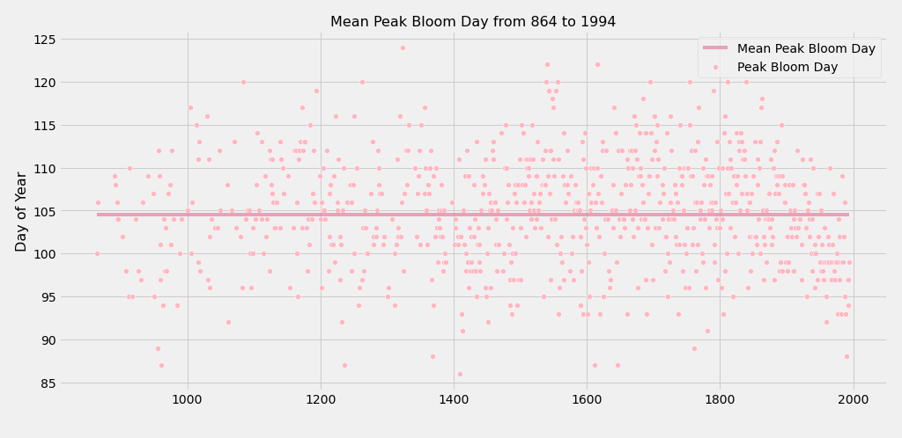

# Sakura Bloom Analysis


## Background

## Purpose

Descripitve analysis on the Cherry Blossom data set to determine if there are trends in the peak bloom days for Kyoto sakura over time.

## Setup Instructions
To setup the project environment, cd into the project folder and run `conda env create --file sakura.yml` in your terminal. Next, `run conda activate sakura`.

## Data

- Historical Series of Phenological data for Cherry Tree Flowering at Kyoto City (and March Mean Temperature Reconstructions) by Aono and Kazui, 2008; Aono and Saito, 2010; Aono, 2012.

#### Data Understanding

- The the data was presented in the form of two Excel spreadsheets:
    - 'KyotoFullFlower7.xls' (1240 rows of bloom data and information about the primary sources of the the bloom data)
    - 'TempReconst7Final.xls' (1196 rows of temperature data and information about the methodology surrounding the data)

[Data Set Website](http://atmenv.envi.osakafu-u.ac.jp/aono/kyophenotemp4/)

#### Methods & Data Preperation

[EDA Notebook](notebooks/eda/sakura_data.ipynb)

Python, Pandas, and Seaborn were used for data preparation, analysis and visualization. 

- After loading the spreadsheets into two data frames, the keys for each data set were seperated from the raw data and collected into smaller lookup data frames.

- Column names were added to the dataframes, datatype conversions were performed, and null values were dropped. 

- Five-year moving average and fahrenheit temperature features were added and the two data frames were joined.

## Results

We can see that the average peak bloom day has occured around the 105th day of the year through most of the years on record. 



However, plotting a 5-year moving average reveals that the peak bloom day has been moving earlier in the year over time since the 1800s. 


The temperature data also shows a warming trend beginning in the 1800s and continuing into the present.


Lastly, plotting peak bloom against temperature shows a correlation between higher temperatues and earlier peak bloom days.


## Conclusion

## Repo Structure
```
├── data
│   ├── KyotoFullFlower7.xls
│   └── TempReconst7Final.xls
├── images
│   ├── bloom_temp.png
│   ├── bloom_year.png
│   ├── march_temp.png
│   ├── mean_bloom.png
│   └── sakura.jpeg
├── notebooks
│   ├── eda
│   │   └── sakura_data.ipynb
│   └── report
├── sakura.md
├── sakura.yml
└── src
    └── visuals.py

```